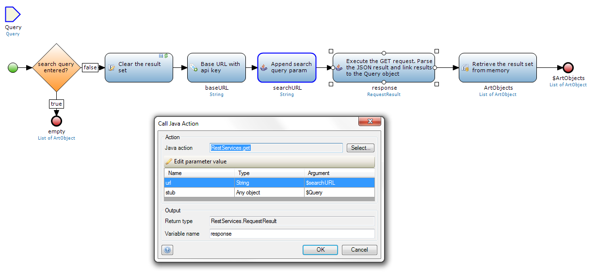
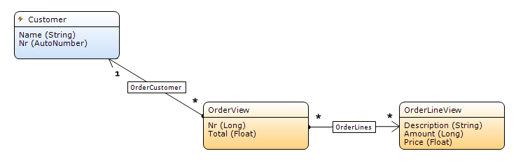
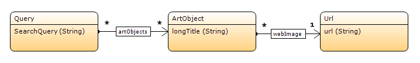

# Mendix REST Services module


Welcome to the Rest Services module. This module can be used in [Mendix](http://www.mendix.com/) apps as toolkit if you want to achieve one of the following three purposes:

1. Consume JSON REST based services
2. Publish data or microflows through REST API's
3. (Real time) Synchronization of data between Mendix applications

## Related resources
* RestServices on [GitHub](https://github.com/mweststrate/RestServices)
* Restservices in the [Mendix Appstore](https://appstore.mendix.com/link/app/rest%20services)
* Blog post: [Consuming your first REST service](http://www.mendix.com/blog/consuming-first-rest-service/)
* Blog post: [REST Part II: Publishing Microflows with REST](http://www.mendix.com/blog/rest-part-ii-publishing-microflows-rest/)

# Table of Contents

* [Getting Started](#getting-started)
* [Consuming REST services](#consuming-rest-services)
* [Publishing REST services](#publishing-rest-services)
  - [Microflows](#publishing-a-microflow)
  - [Data](#publishing-a-data-service)
* [(Real time) data synchronization](#data-synchronization)
* [About JSON serialization](#json-serialization)
* [About JSON deserialization](#json-deserialization)
* [Working with files / binary data](#sending-and-receiving-files)
* [Overview of all functions](#complete-function-reference)
* [Notes for contributers](#development-notes)
* [Changelog](#changelog)

# Getting Started

1. The *RestServices* module can be downloaded from within the Mendix Business Modeler in the Mendix Appstore into any model that is build with Mendix 4.4.4+ or Mendix 5.3.1+.
2. The RestServices module depends on the on the [Community Commons](https://appstore.mendix.com/link/app/community%20commons) module, version 5.4 or higher. Download this module as well if it is not already part of your project.
3. TODO: connect userroles and layouts (mx 5)
3. *[Optional]* If you want to publish REST services or use the data synchronization features, add `IVK_OpenServiceOverview` to your main navigation if you want to use the administrative features of the RestServices module. Make sure to map your administrative project role to the `Administrator` role in the RestServices module as well.
4. *[Optional]* If you want to publish REST services, add `StartPublishServices` to the startup sequence of your application. Also, the 'rest/' request handler needs to be opened if running in the Mendix Standard Cloud (or on premise).
5. It is strongly recommended to **not** use the default HSQLDB engine if you want to publish RestServices while running locally.

# Consuming REST services
NOTE: Since Mendix 6.6, you can consume REST services directly with the Call Rest microflow action. You can use Import and Export mappings to create and read messages. See https://world.mendix.com/display/refguide6/Consumed+REST+Services

*This readme is the reference guide. For a quick how-to you might take a look at this [blog post](http://www.mendix.com/blog/consuming-first-rest-service/) as well.*

This module is able to invoke most, if not any, REST service which is based on JSON, form-data, multipart or binary data. The operations in the 'Consume' folder of the module provide the necessary tools to invoke data. The work horse of all this operations is the java action `request`. Most other methods are wrappers around this operation.



## The `Request` java action
Request performs an HTTP request and provides the means to both send data and receive data over HTTP. Its parameters are defined as follow.

* `method`, the HTTP method to use, which is one of `GET`, `POST`, `PUT` or `DELETE`. Which method to use is usually defined in the documentation of the service to consume. Otherwise see the 'HTTP verbs in REST' section for more information. As a rule of thumb: If you only want to fetch data use `GET`, otherwise use `POST`.
* `url` defines the HTTP endpoint to which the request should be send.
* `optRequestData` is an optional Mendix object that provides the parameters which are used in the request (note that it is also possible to pass parameters in the `url` itself). This object will be serialized to JSON (see the corresponding section) and be passed to the endpoint. The format in which the data will be send depends on the actual `method` and `sendWithFormEncoding` parameter.
* `optResponseData` is an optional Mendix object in which the response data will be stored. This object will be filled by any JSON / file data which is in the response body of the request. See the 'JSON deserialization' section for more details how a JSON body is parsed into a Mendix object.

This method returns a `RequestResult` object if the service responds with HTTP response `200 OK` or `304 Not Modified`. In all other cases an exception will be thrown.

## The `RequestResult` object
Most REST operations return a `RequestResult` object which contains the meta information of a response. An instance contains the following fields:

* `ResponseCode` stating whether the server responded with 'OK'  or 'Not modified'. A 'Not modified' response might be send by the server if, for example, an 'If-none-modified' header was send, which indicates that you received the proper response to this request in an earlier request. See for example [ETags](http://en.wikipedia.org/wiki/HTTP_ETag). The value will be 'Error' if an error occured during a REST reques (in which case the current RequestResult object can be retrieved by calling `getRestConsumeError`).
* `RawResponseCode` idem, but as HTTP status code. Note that the status code -1 will be used if there was a connection error. 
* `ETag` if the response contained an `ETag` header, it is picked up and stored in this field. It can be used as optimization for any subsequent requests.
* `ResponseBody` the full and raw response body of the request. This field is only set if the body of the response is not yet parsed (by providing an `optResponseData` parameter for example).

## Sending request headers
Many REST services require the usage of custom request handlers for authentication, caching etc. In the RestServices module, any call to `addHeaderToNextRequest` will add a header to the *next* (and only the next) request that will be made by the current microflow.

## Authentication
The RestServices module only supports *Basic authentication* out of the box. But it also possible to authenticate using OAuth or other security protocols by following the specs of the designated service. (There is a working Dropbox integration app based on a combination of the RestServices module and the Deeplink module for requesting tokens).

Basic authentication credentials can be send by using `addCredentialsToNextRequest` just before the actual request is made. Too make life easier, it is also possible to use `registerCredentials`, which will send credentials with *any* subsequent request to the same host.

## Consume methods
For all standard HTTP verbs there is a method available which wraps the `request` operation, but simplifies the arguments one has to provide. See the [HTTP Verbs](#http-verbs-in-rest) section for best practices about when to use which verb. For a complete list of consume methods see the [REST functions overview](#rest-functions-overview).

### `get`
Tries to retrieve an object from the provided `resourceURL`. Expects JSON data which will be parsed into the `targetObject` object. A `targetObject` object *should* be a just created, empty and transient object. This object will be filled with data as described in the 'JSON Deserialization' section.

### `get2`
Similar to get, but also accepts a `requestData` parameter. The primitive members of that object will be appended to the `resourceUrl` as HTTP parameters. For example a member 'q' with value 'Rest Services' will be appended to the url as '?q=Rest%20Services'.

### `getCollection`
Tries to retrieve a list of objects from the provided URL. The expected response body is either an array of JSON objects, or an array of URLs, which will be retrieved automatically to retrieve all the items in the array. `getCollection` uses streaming to make the process as memory efficient as possible.

The `resultList` parameter should be a completely empty list, but of the same type as `firstResult`. The `firstResult` object will be used to story the first result in and should be a new, empty, transient object.

<small>Needing to provide both the `resultList` and `firstResult` parameters might seem a bit awkward, but the `firstResult` object is required by the actual implementation to determine the type of the result set, because lists in Mendix are untyped at runtime)</small>


### `getCollectionAsync`
The behavior is similar to `getCollection`, but its implementation is very suitable for very large response sets. Instead of building a list, the `callbackMicroflow` will be invoked on each individual item in the response array. This way, only one item is in memory of the server at any given time.

### `post`
Submits an object to the remote server. The `requestData` object will be serialized to JSON as described in the 'JSON Serialization' section. If the `submitAsFormData` parameter is set, the data will not be encoded as JSON but as form data (which is commonly used for submitting web forms for example). Note that form data only supports flat objects with primitive members only.

### `delete`
Tries to delete a resource at the given URL.

### `put`
Similar to `post`. See the 'HTTP verbs' section or the specs of the service you are consuming to find out whether to use `post` or `put`.

### `getRestConsumeError`
Can be used in the error handler of a REST request. Returns the `RequestResult` object with the response data that would also be returned otherwise if the request was successful. The `ResponseCode` field will be set to `Error`.

## Template urls when consuming REST services. 

It is possible to use template URLs when consuming REST services. This makes it possible to substitute values directly in an url. For example when using the `put` function with the url
`http://myservice.com/groups/{groupId}` and the data object `{ groupId : 123, description : "group"}`, a PUT request will be send to the substituted URL `http://myservice.com/groups/123` with payload data `{ description : "group" }`.

# Publishing REST services

Publishing a REST service is pretty straight forward with this modules. The module provides publishing REST services in two flavors:

1. Publishing operations, based on a single microflow.
2. Publishing a part of your data model, and providing a typical rest based API to retrieve, update, delete, create and even real-time sync data.

PLEASE NOTE THAT TO BE ABLE TO PUBLISH ANY SERVICE, THE MICROFLOW `STARTPUBLISHSERVICES` SHOULD BE CALLED DURING STARTUP OF THE APP!

## Publishing a microflow

*This readme is the reference guide. For a quick how-to about publishing microflows you might take a look at this [blog post](http://www.mendix.com/blog/rest-part-ii-publishing-microflows-rest/)*

Publishing a microflow is conceptually very similar to publishing a webservice. It publishing a single operation based on a microflow. The difference with a normal Mendix webservice is the transport method; instead of SOAP the RestServices module provides an interface which supports JSON based messages or form / multipart encoded messages (typically used to submit webforms) or raw binary data (for efficient downloads for example).

A published microflow should always have a single transient object as argument. Each field in this transient object is considered a parameter (from HTTP perspective). This means that if you have multiple primitive parameters for your service, for example `offset` and `limit`, you should create a new transient entity that has two fields with the names `offset` and `limit`. 

Your service can now be invoked by either providing the values as HTTP parameters (for example: `GET http://apphost/rest/yourservice?offset=3&limit=5`) or by sending these fields in the json body of the request. In both cases the fields of your input parameter will be set. For example:

```
POST http://apphost/rest/yourservice
{ offset : 3, limit : 5 }
```

Complex objects are supported if JSON is used as transport mechanism. The return type of the microflow should again be a transient object or a String or a filedocument. In the latter case, the string is considered to be the raw response of the operation which is not further processed.

It is possible to build publish services that accept or respond with files as well. See for more details the [working with files](#sending-and-receiving-files) section. 

Publishing a microflow is as simple as calling `CreateMicroflowService` with the microflow that provides the implementation. The name of the operation will be derived form the microflow name. The meta data of the operation is published on *&lt;app-url&gt;/rest/*, including a [JSON-schema](http://json-schema.org/) describing its arguments. The endpoint for the operation itself is *&lt;app-url&gt;/rest/&lt;public-name&gt;*. For securing your microflow service see [Securing published services](#securing-published-services) 

### Microflows with template paths

It is possible to provide a template path when registering a microflow service. This allows for constructing more complex URLs, from which values are parsed. For example, a microflow could be defined with the template path: `groups/{groupId}/users/{userId}`. If that service would be called with `http://myapp.com/rest/groups/123/users/John`, the attribute `groupId` of the input argument of the microflow would be instantiated with the value `123`. Likewise, the attribute `userId` would be instantiated with the value `John`.

## Publishing a data service

A Published Service provides a JSON based API to list, retrieve, create, update, delete and track objects in your database. Documentation for these services will be generated automatically by the module and can be read by pointing your browser at *&lt;app-url&gt;/rest/*. Responses can be rendered JSON, XML or HTML, depending on the `Accept` headers of the request. Depending on the selected features, the following endpoints are available for a data service after the base url `<app-url>/rest/<service-name>`:

| Method | Url | Description |
|--------|-----|-------------|
| GET | /**?about** | Meta description of this services. Describes the endpoints and datatypes of this service in great detail. |
| GET | / | List of all objects published by this service. |
| GET | /**&lt;key&gt;** | Returns a specific instance, identified by the *key*. |
| POST | / | Creates a new object and initializes it based on the JSON body of the request. Returns the `key` of the newly created object. |
| PUT | /**&lt;key&gt;** | Creates or updates the object with the specified &lt;key&gt;. Returns nothing. |
| DELETE | /**&lt;key&gt;** | Deletes the object with the specified &lt;key&gt;. Returns nothing. |
| GET | /**changes/list** | Returns all objects of this service change by change. Can be used to synchronize data. |
| GET | /**changes/feed** | Similar to *changes/list* but keeps the HTTP connection open to be able to push any future changes to the consumer. |

### How a data service works

The central idea behind a service that there is a persistent entity in your database acting as data *source* for your service. Furthermore your model should define a transient object that will act as *view* object of your data, so that your internal data structure is not directly published to the outside. This allows for better maintainability and it guarantees that you can pre- or post-process your data when required.

When publishing data, the *Publish Microflow* has the responsibility of converting *source* objects into *view objects*. When processing incoming data, the *Update Microflow* is responsible for exactly the reverse process; transforming a *view* as provided by some consumer into real data in your database.

Each *source* object should be uniquely identifiable by a single *key* attribute.

For example: *GET &lt;your-app&gt;/rest/&lt;service name&gt;/&lt;identifier&gt;* will search for the first *source* object in your database which *key* value equals the *identifier*. If found, this object will be converted by the *Publish Microflow* into a *view object*. This *view object* will be serialized to JSON (or HTML or XML) and returned to the consumer.

### Creating a new service

Creating a new JSON based data service with full CRUD support is pretty straightforward with the RestServices module. The easiest way to start is to connect the microflow `IVK_OpenServiceOverview` to your navigation and create a new Published Service after starting your app.

Once you have figured out the correct configuration for your data service, a best practice is to use the `GetOrCreateDataService` microflow in the startup microflow to create your service configuration. Alter and commit the properties of the resulting ServiceDefinition to update the configuration. If the configuration contains consistency errors, those will will be listed in the log of your application.

### Configuring your service

You can further configure the service from either a microflow or the form in the running app by setting the following properties.

#### Core configuration

Property | Default value | Description
-------- | ------------- | ----------
Name | (required) | Public name of this service. The endpoint of the service will be *&lt;app-url&gt;/rest/&lt;name&gt;*. Example: `Tasks`
Description | (optional) | Description of this services. Will be part of the generated meta data
Source Entity | (required) | The entity in the data model that should be published. Should be persistable. Example: `MyModule.Task`
Source Key Attribute | (required) | Attribute that uniquely identifies an object and which will be used as external reference to this object. The attribute should not change over time. Example: `TaskID`
Source Constraint | (optional) | XPath constraint that limits which objects are readable / writable through this service. It is possible to use the `'[%Current_User%]'` token inside this constraint, unless the *Enable Change Log* flag is set. Example: `[Finished = false() and MyModule.Task_Owner = '[%Current_User%]']`
Authentication Role / Microflow | `*` | See [Securing published services](#securing-published-services) 
On Publish Microflow | (optional) | Microflow that transforms a *source object* into some transient object which (the *view*). This view will be serialized into JSON/HTML/XML when data is requested from the service. The speed of this microflow primarily determines the speed of the service as a whole.
On Update Microflow | (optional) | Microflow that processes incoming changes. Should have two parameters; one of same type as the *source entity*, and one which is a transient entity. The transient object will be constructed with JSON data in the incoming request. This transient object should be processed by the microflow and update the *source* object as desired. Use the `ThrowWebserviceException` method of Community Commons to signal any exceptions to the consumer.
On Delete Microflow | (optional) | Similar to the *On Update Microflow* but takes a String attribute as argument, that represents the *key* of the object that should be deleted

#### Features

Property | Default value | Description
-------- | ------------- | ----------
Enable GET | `true` | Allows requesting individual objects using GET at *rest/servicename/objectid*
Enable Listing | `true` | Allows listing all available objects using GET at *rest/servicename/*
Enable Update | `false` | Allows consumers to update existing objects using PUT or POST at *rest/servicename/objectid*
Enable Create | `false` | Allows consumers to create new objects using POST at *rest/servicename/*
Enable Delete | `false` | Allows consumers to remove existing objects using DELETE at *rest/servicename/objectid*
Enable Change Log | `false` | See next section
Use Strict Versioning | `false` | If set to true, all requests that modify data are required to provide an `if-none-match` header, to verify that the request is based on the latest known version. This way conflicting updates are detected and it is not possible to base changes on stale objects

#### Securing published services

For a published service, three authentication models can be used:

1. `*` indicates that a service is world accessible. This holds for both reading and writing (if applicable)
2. `Rolename` indicates that authentication is required, and that credentials for a user that has a specific role are required. This works similar to webservice authentication, except that the 'WebServiceUser' attribute should not be set. Normal users can perform REST requests as well. The REST module will attempt to pick up any client session that is available (useful when invoking the service from a browser, using Ajax for example). If no such session is found, basic authentication needs to be provided to send credentials to the service. 
3. `Module.Microflowname` can be used to set up a custom authentication mechanism. This microflow shouldn't require any arguments and return a System.User object or null (if authentication failed). If a user object was returned, the service will be invoked under a fresh session of that user. In the microflow, you can use `getRequestHeader` calls to extract HTTP headers from the request, which can be used to perform authentication. This is very useful if you want to setup authentication using a api key for example. 

#### Enabling the change log

The *Enable Change Log* property has significant impact on the behavior and internal working of the service. It introduces a cache in which the JSON representation of each objects are stored and provides the possibility to synchronize with consumers over time. See the [Data synchronisation](#data-synchronisation) section for more details. Enabling the changelog has the following consequences:

* Two new endpoints are created: *rest/service/changes/list* and *rest/service/changes/feed*. Both endpoints provide a list of all changes which where made to the *source* collection. The endpoints accept an `since` parameter, which can be used to only retrieve changes which were not synced yet. The API and behavior are heavily inspired by the [CouchDB changes API](http://couchdb.readthedocs.org/en/latest/api/database/changes.html).
* Requests are served from the cache instead of the database directly. To update an item in the cache, the model needs to call `publishUpdate` or `publishDelete`. This can either be done as *after commit* / *after delete* event, or in the logic of your model. Changes are not visible for consumers until one of these methods is called by the model.
* It is no longer possible to use the `'[%CurrentUser%]'` token in constraints; the cache is shared with all users connecting to the server so different users can no longer be distinguished.
* The performance of retrieving objects is improved, since they are stored in serialized form internally.
* If, for example, the domain model of your *source* or *view* object changes, the cache becomes stale. Most model changes are detected by the RestServices module automatically, but you can force rebuilding the complete index by invoking `RebuildServiceIndex`.

# Data synchronization

## The change log

If the change log is enabled for a service the RestServices module will preserve a change log with which consumers can synchronize. A typical change item like this:
```
{
  "seq": 2,
  "deleted": false,
  "key": "2"
  "url": "http://localhost:8080/rest/customers/2",
  "etag": "6a068f795f26d65c5aa8ef335c6e9ac1",
  "data": {
    "Name": "bla",
    "Nr": 2,
    "Orders": []
  },
}
```
The `seq` attribute indicates the revision this service is currently at. For each changes that happens with the entity that is published by this service, this sequence number is increased by one. Consumers should keep track of this sequence number, as they are only required to fetch all the changes with a higher number using the `since` parameter.

Revisions are not kept forever, they are removed as soon as they are shadowed by a newer revision for the same `key`. The `key` attribute describes which object this change is about. This means that a consumer actually might miss some changes, but that the end result after synchronization will always be consistent with the publisher.

The `url` is the fully qualified url at which this object could be fetched using a GET operation. The `etag` value indicates the current version of the object altered by the change. If the `deleted` attribute is false, the object has been created or changed, and its actual contents can be found under the `data` attribute.

To set up a changelog in your data service, please read the [Enabling the change log](#enabling-the-change-log) section.

## Reading the change log

Retrieving the changes published by a services is as simple as sending a GET request to *rest/service-name/changes/list*:

```
+----------+                                                           +-----------+
|          |  ------ GET /rest/service/changes/list?since=<seq>----->  |           |
| consumer |                                                           | publisher |
|          |  <------------- returns list of changes ----------------  |           |
+----------+                                                           +-----------+
```

The `since` parameter specifies the last change the consumer already knows. If no changes has been received before, use '0'. Further parameters are described in greater detail in the generated service description.

A second endpoint available for retrieving changes is *rest/service-name/changes/feed*. This service yields the same results as the list service, except that the HTTP request does not end after all known changes are send. Rather, the connection is kept open so that new changes can be pushed back to the consumer in real time. If the connection is closed for any reason the consumer should try to reconnect automatically.

The RestServices module provides several methods to consume a changelog published by another app. Those can be found in the `CONSUME/Change Tracking` folder. Note that for all these functions only the *collection* URL needs to be specified (for example: *http://app/rest/tasks*). Furthermore the module automatically tracks which changes have been received already, so there is no need to specify the `since` parameter.

* `fetchChanges`: Requests recent changes for a certain collection using the *list* API. The *updateMicroflow* should have one parameter of some transient object type. The microflow will be called for each change and the parameter will be initialized by deserializing the `data` field of the change. The *deleteMicroflow* should have a string parameter, which will be initialized to the *key* of the object to be deleted.
* `followChanges`: Similar to `fetchChanges`. Requests recent changes and start listening for new incoming changes using the *feed* API.
* `unfollowChanges`: Stop listing to changes
* `resetChangeTracking`: Resets the last know sequence number to zero. This means that upon the next synchronization, *all* data will be retrieved again.

The state of the change log can be viewed in the RestServices overview form, both as consumer and as publisher.

# JSON Serialization

The JSON serialization process starts with a (preferably) transient object and converts it into a JSON structure as follows:

1. Given a transient object, a new JSON object is created (`{}`)
2. Each of its primitives members is added as key value pair to the JSON object. The 'nearest' json type is used, for example integers and longs are turned into numbers, booleans in to booleans and the others into strings (or `null` values). For example: `{ "task" : 17, "description" : "Buy milk" }`. Decimals are serialized as string to preserve precision. For a numeric presentation please use the Mendix float attribute type. 
3. For each owned reference that points to a *transient* object, another key/value pair is added to the object. As key the name of the reference is used, but *excluding* the module name. As value either `null` is used if the reference is not set, or the child object is serialized into a JSON object as well, using this very same procedure.
4. For each owned referenceset that points to a *transient* object, the same approach is taken, except that the value is an array (`[]`) to which each serialized child object is added.
5. If an owned reference(set) points to a *a* persistent object the reference is not serialized, unless a data services is defined for the specified entity. In such a case, the url of the referred object is determined and added to the result.
6. For file documents special serialization rules apply. See the [working with files](#sending-and-receiving-files) section for details

For example the following domain model results in the JSON object listed below, assuming that the serialization process is started with an *OrderView* instance:


```
{
  "Nr": 1,
  "Total": 9.4,
  "OrderCustomer": "http://localhost:8080/rest/customers/3",
  "OrderLines": [
    {
      "Description": "Coffee Biscuits 36pcs",
      "Amount": 2,
      "Price": 0.89
    },
    {
      "Description": "Dark Coffee 36pads Limited Edition",
      "Amount": 3,
      "Price": 2.54
    }
  ]
}
```

It is possible to manually trigger the serialization process by using the `serializeObjectToJson` java action.

## Serializing complex attribute names

Some API's that are consumed might require attribute names that would not be valid in Mendix. For example an API might require an attibute that is called `id` or `my-profile-url`. To override the default name under which a member is serialized, add an additional member to the Mendix object that has the exact same name as the member you want to serialize, but appended with `_jsonkey`. The value of this attribute should be a string and contain the name under which you want to serialize. This works for assocations as well (but note that the module name of the association should be skipped). 

For example an object with the following attibutes and values: 

* attribute `_id` with value "3"
* attribute `_id_jsonkey with value "id"
* attribute `profileUrl` with value "https://github.com/mweststrate"
* attribute `profileUrl_jsonkey` with value "my-profile-url"

Will result in the following JSON:

```
{ id : 3, my-profile-url : "https://github.com/mweststrate" }
```

# JSON Deserialization

The JSON deserialization process is the inverse of the serialization process and can be triggered manually by calling `deserializeJsonToObject`. The process always starts with a freshly created transient object (the *target*) and the JSON structure as string. The root of the JSON structure should always be an JSON object (for arrays, see the `getCollection` method). The parse process then starts as follows:

1. For each primitive *key*/*value* pair in the JSON object, a matching (see below) primitive attribute is searched in the transient object. If found, the *value* is parsed and set.
2. If the primitive is of type string, but the member with the same name in the transient object is a reference, the process assumes that the string value represents an url. The url is then fetched using a GET request and its result is also interpreted as JSON and deserialized. The resulting object is assigned to the reference.
3. If the member in the *target* object is a reference, and the *value* is a JSON object, a new object of the child type of the reference is instantiated, and the JSON *value* is parsed into that object; which then is stored in the references.
4. If the member in the *target* object is a referenceset, and the *value* is a JSON array of JSON objects, well, that works the same as a mentioned in *3.* but then a complete referenceset is filled.
5. If you need to parse a JSON array of primitive values, use a referenceset that has as child `RestServices.Primitive`. These objects can hold a JSON primitive and allows to create primitive lists which don't exist natively in Mendix.

## Matching attibute names

A member name matches if the names are the same in a case *in*sensitive way. The module will also look for attributes that have an additional underscore (`_`) as prefix. This is to be able to prevent name collisions with references and to be able to use attributes with a name that are reserved within Mendix. Furthermore, if the characters `-` or `$` are used in json (or any other strange characters that are not allowed in Mendix field names), this maps to the `_` underscore character in the Mendix attribute name. For associations, the module name is never considered. Pro tip: fill these properties with the proper default value.

Some examples:

* The json key `count` maps to the Mendix attributes `count` and `_count`
* The json key `id` maps to the Mendix attribute `_id` (since `id` is reserved in Mendix)
* The json key `my super dooper complex @#-$#$% key` maps to the Mendix attribute `my_super_dooper_complex_________key`

## Deserialization example
For example `https://www.rijksmuseum.nl/api/en/collection/?key=XXXXX&format=json&q=geertgen` generates the following JSON (shortened a bit for readability) which can be parsed into the domain model as shown below, assuming that parsing starts with an instance of the `Query` entity. Note that only some specific attributes of interest are made part of the domain model.

```
{
  "elapsedMilliseconds": 51,
  "count": 9,
  "artObjects": [
    {
      "links": {
        "self": "https://www.rijksmuseum.nl/api/en/collection/SK-A-2150",
        "web": "https://www.rijksmuseum.nl/en/collection/SK-A-2150"
      },
      "id": "en-SK-A-2150",
      "title": "The Adoration of the Magi",
      "hasImage": true,
      "principalOrFirstMaker": "Geertgen tot Sint Jans",
      "longTitle": "The Adoration of the Magi, Geertgen tot Sint Jans, c. 1480 - c. 1485",
      "webImage": {
        "guid": "9b0a55b9-5bf9-4670-9a24-929d076b5bd1",
        "width": 1929,
        "height": 2500,
        "url": "http://lh6.ggpht.com/JE0o7Cgs3kKT5wDAR0Ks32zuTZUulpAcJFwTFNNJMJ6ENOVL3PE1MaKUEmFP-kdTqxXlDGtlNIZrryxe10G8g3mm_Q=s0"
      },
      "headerImage": {
        "guid": "93364abc-e6a2-476b-aa07-197cd90b0dda",
        "offsetPercentageX": 50,
        "offsetPercentageY": 50,
        "width": 1920,
        "height": 460,
        "url": "http://lh5.ggpht.com/4go9ib-06Mq5jHS2RltLrwhsE1-0TKBx2PnfDjzPIyCL7kcbMc_8aNpng7lHipgPBwBJNbL95WohglA-KkK2avtGczsY=s0"
      },
      "productionPlaces": [
        "Haarlem"
      ]
    }
  ]
}
```


## Deserialization and optional / missing attributes

When it comes to deserializing attributes for incoming objects (in, for example, a microflow service), attributes will keep their default values from the domain model if they are lacking in the input. For some primitive types this can be confusing, especially for booleans. For booleans, you can use the `RestServices.BooleanValue` enumeration to be able to distinguish the absence of a value in your transient object, by putting the default value to empty.

# Sending and receiving files

## Publishing operations that work with files
It is possible to send or receive files using the RestServices module. To publish an operation that supports binary data you can define a microflow service which input or output argument (or both) inherits from a `System.FileDocument`. If the input parameter is a filedocument, it interprets requests with `Content-Type: multipart/form-data` correctly if there is one *part* that contains binary data. The other form data parameters can be picked up if a similarly named attribute is present in the type of the input argument. If the return type of a microflow service is a filedocument, the binary contents is streamed in raw format to the consumer, using `Content-Type: application/octet-stream`.

## Consuming operations that work with files
It is possible to send binary data using the `post` java action. If the `submitAsFormData` parameter is set, the file is send using `Content-Type: multipart/form-data`, and other attributes of the filedocument are included as well as form parts. If the root object has references to other filedocuments, each of the referred file documents will be added as part to the multipart request. The part name will equal the reference name. This way it is possible to send multiple files with a single request. 

If `submitAsFormData` is set to false, the contents of the filedocument is streamed raw in the request body to the publisher. Any other attributes in the filedocument are added as request parameters to the target url.

If the consumed service responds with binary data, this is picked up properly by the generic `request` java action if the `optResponseData` parameter inherits from `System.FileDocument.`

# REST functions overview

## Consume

#### addCookieToNextRequest
Sends a cookie along with the next request that will be made

#### addCredentialsToNextRequest
Sends a username / password combination along with the next request, using Basic authentication.

#### addHeaderToNextRequest
Sends a header along with the next request. 

#### addIfNoneMatchHeader
Sends an If-None-Match header along with the next request, to compare an [ETag](http://en.wikipedia.org/wiki/HTTP_ETag) from a cache with the latest version on the server. Data services published with the Rest Services module support the ETag mechanism out of the box. 

#### delete
Delete an object on a remote service by permorming a HTTP DELETE request

#### fetchChanges
Fetches any missing changes from a remote collection (published by a change-tracking enabled data service) that is being tracked by this app. 

#### followChanges
Fetches any missing changes from a remote collection (published by a change-tracking enabled data service) that is being tracked by this app and keeps the connection open to listen to any new incoming changes. 

#### get
Fetches a (JSON) resource from a remote server by performing a HTTP GET request.

#### getWithParams / get2
See `get`, but automatically converts request data into URL parameters.

#### getCollection
Fetches a collection from a remote server by performing a HTTP GET request. In contrast to `get`, getCollection excpects an JSON array instead of a JSON object as response. 

#### getCollectionAsync
See `getCollection`. The `Async` variation is suitable for very large collections which might not fit in memory otherwise. Each item of the collection will be streamed, parsed and processed by a callback to minimize memory consumption.

#### getResponseCookies
Returns a list of cookies that where set by the remote server as part of the response to the latest request. 

#### getResponseHeader
Returns a specific header that was set by the remote server as part of the response to the latest request. 

#### getRestConsumeError
Returns the meta data and response body of the latest (failed) request. 

#### post
Adds an object to a remote collection or performs a form post, using HTTP POST.

#### postWithResult / post2
Adds an object to a remote collection, using HTTP POST, parses the response data into a Mendix object.

#### put
Adds/ updates an object in a remote collection using HTTP PUT.

#### registerCredentials
Similar to `addCredentialsToNextRequest`, but the credentials will be reused automatically by any subsequent request to the same domain.

#### request
Generic method to make a HTTP request. `post`, `put`, `get`, `delete` are wrapper methods around this function. Request allows for less common combinations of parameters. 

#### resetChangeTracking
Resets any state information this app has about a remote collection that is being tracked. 

#### setGlobalRequestSettings
Sets settings for all requests that are executed by RestServices module.
* `maxConcurrentRequest` - number of maximum concurrent requests executed. This will set concurrency level per host. Total concurrency level is double this setting.
* `timeout` - timeout specified in milliseconds. This will set timeout for both establishing connection and waiting between data chunks arrived from server.

#### unfollowChanges
Stops tracking a remote collection, which was being followed as result of a `followChanges` call. 

## Publish

#### CreateMicroflowService (microflow)
Registers a new microflow service. The microflow will be available for consumption through the REST module. 

#### GetOrCreateDataService (microflow)
Registers a data service. This can be used to open a REST based data service on a part of your domain model. 

#### getRequestCookies
Returns a list of cookies that was send to this service by the client. Can be used in the context of a microflow or data service. 

#### getRequestHeader
Returns a header that was send to this service by the client. Can be used in the context of a microflow or data service. 

#### publishDelete
Distributes (possibly real-time using server push) the deletion of an object to all consumers of a data service. Can only be used in combination with data services that has change tracking enabled. 

#### publishUpdate
Distributes (possibly real-time using server push) the creation or update of an object to all consumers of a data service. Can only be used in combination with data services that has change tracking enabled. 

#### setResponseCookie
Sends a cookie to the client using the `Set-Cookie` header. 

#### setResponseHeader
Sets a specific header on the response. 

#### setResponseStatus
Sets the HTTP response status of a request. 

#### throwRestServiceException
Throws a RestService exception, accepts the following attributes:

* httpStatus: The HTTP status of the request. Has to be between 400 and 599
* errorMessage:	The error message
* errorCode: Custom error code for this exception, to make the error easier recognizable and referable.

RestServiceExceptions are compatible with Webservice exceptions, so they can be used safely in microflows that are published through webservices as well. 

## Util

#### appendParamToUrl
Appends an url parameter to an url. The method takes care of properly appending the parameter and URL encoding the value.

#### appendSlashToUrl
Appends a forward slash `/` to an url, if its not there yet. 

#### copyAttributes
Copies similarly named primitive attributes from one object to another. 

#### deserializeJsonToObject
See [JSON deserialization](#json-deserialization)

#### getRestBaseUrl
Returns the base url on which the rest services are published for this app. For example: `http://localhost:8080/rest/`

#### isUrl
Checks whether a string is a valid URL. 

#### isValidObjectKey
Checks whether a value can be used as object key in a data service

#### IVK_OpenServiceOverview
Shows an overviw of all data service definitions.

#### serializeObjectToJson
See [JSON serialization](#json-serialization)

#### setRestBasePath
Sets an alternative base path for the RestServices modules. (Default: `rest/`). Note that in sandbox deployments, `ws-doc/` will be used automatically. 

#### StartPublishServices
Should be called from the apps startup microflow. Without, no microflow or data service will be served. 

#### urlEncode
Escapes a string in such a way that it can be used as part of an URL. 

# Known Integrations

We know that the RestSevices module has already been used successfully to integrate with the following services:

* Dropbox.com
* Paydro.net
* Postcodeapi.nu
* Rijksmuseum.nl

# Development notes

* Feel free to fork and send pull requests!
* Use the [mxgit](https://github.com/mweststrate/mxgit) tool to track and merge changes in the mpr file.
* Note that this is a GitHub repository which is based on git, in contrast to the Mendix TeamServer, which is based on SVN. So the build-in Teamserver support of the Mendix Modeler will not work for this repository!
* If you want to receive access to the Mendix Project in which this module is managed, feel to request me an invite! The backlog of the project is also managed there.
* Unit tests are defined in the *Tests* module. Those can be run in the usual way using the already included *[UnitTesting](https://appstore.mendix.com/app/Unit%20Testing)* module

# RestServices, Web Services or App Services?

How does REST Services relate to Mendix Webservices and Mendix AppServices? Mendix Webservices are the de-facto integration method. Webservices are well supported in the Mendix Modeler and allow you to publish and consume operations. Webservices rely on the WSDL / SOAP standards for definition and transport.

Mendix Appservices are build on top of webservices and make integration between Mendix Apps easier. They allow you to skip object mappings and provide an API versioning system.

RestServices allows you to consume and publish operations as well, but based on the JSON standard and REST principles. Besides JSON, the module also provides full support for form-encoded, multipart and binary data transfer, allowing the module the integrate with almost any REST service.

It is also possible do share data using RestServices as the module generates REST based crud operations for your data and (real-time) synchronization strategies.

# HTTP Verbs in Rest

See the table at [http://en.wikipedia.org/wiki/Representational_state_transfer#Applied_to_web_services](http://en.wikipedia.org/wiki/Representational_state_transfer#Applied_to_web_services) to get an idea how the `get`, `put`, `post` and `delete` verbs should be used in combination with rest. The RestServices module respects these best practices as well.
See the table at [http://en.wikipedia.org/wiki/Representational_state_transfer#Applied_to_web_services](http://en.wikipedia.org/wiki/Representational_state_transfer#Applied_to_web_services
